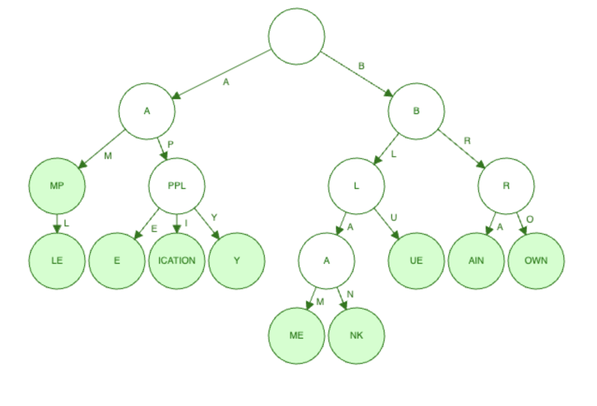
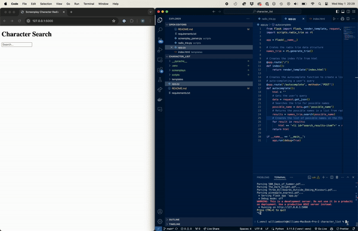

# Storing Parsed Characters from Screenplays into a Radix Trie

This project parses the character names (with speaking roles) from a bundle of screenplays and organizes those into a radix trie which can be searched using an autocomplete text field in the provided web frontend.

## What is a Radix Trie?

A radix trie is a tree data structure that compresses strings by having shared parent nodes with the same prefix then concatenating it with children nodes until a leaf is reached, or more simply, a complete word is formed. The benefit of this structure is in reducing the space needed to store a large collection of data, such as IP addresses or words in a dictionary.

Here is a graphical representation of what the trie looks like.

## Running the Project

I'm providing the instructions for a Mac (because that's what I'm using) but these are adaptable to whatever system you use.

I'd recommend making a virtual environment for this to run in. I used venv.

In a Terminal, run python -m venv .venv

Then type source .venv/bin/activate so that the virtual activate will run Python

Make sure pip is installed. The requirements.txt contains the 3rd party packages required run the following line:

python -m pip install -r requirements.txt --upgrade pip

Now run the application:
flask --app app.py run

In the console, you will see which screenplay is being parsed and then eventually that a development server has been launched and is running. Open up a browser with the following address: 127.0.0.1:5000

Type in the letter "r" (case-insensitive). You'll see a bulleted-list of characters (and their respective screenplay) listed below the text area. Now type the letter "e". You will see the search result narrow to results that match the prefix.

A word of caution: Make sure you are running the Python3 from the virtual environment. I had an issue with Anaconda alias preventing the virtual environment's Python from running.

## Why this Project

This project is a bit of "proof of concept" in a couple ways. 1. For me personally that I can actually build something. 2. That I can build something that might have future commercial viability. Having a little experience in the film industry much of the work for deriving information from screenplays is done by hand. Some of this is by neccessity and some of this by lack of innovation. I wanted to see if there is a way to streamline the assessment of screenplays by extracting key information a computer can accomplish quickly so that a person can focus on qualitative elements of story.

## Commentary on the Project

Being relatively new to programming, I wanted to push myself to cover several topics I hadn't worked on before but was curious about. I tried my hand at data mining and Python web development. Getting these two topics under control actually took more of my time than I expected versus implementing the radix trie. I found that PDFs are difficult to work with and wiring up a simple Flask application can be finicky at times for a beginner. The hardest part for me was diving into JavaScript to make the frontend of this application dynamically update.

## Fair Use Notice

This project uses copyrighted materials (i.e. screenplays in their entirety) under a fair use doctrine for the purpose education and is non-commercial in nature.
